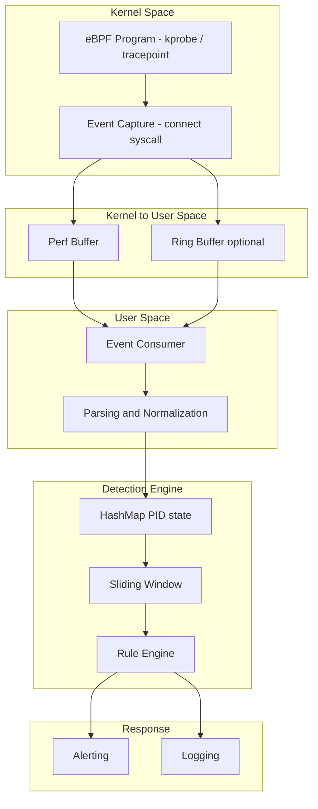

# Why This Project Exists

Traditional security monitoring relies on:

Application logs (controlled by the attacker) Static rule engines (slow to adapt) Post-event analysis (too late)

This project takes a different approach:

Observe from a layer the attacker cannot control — the kernel.

eBPF allows us to instrument runtime behavior directly at the OS level, providing visibility that user-space tools cannot achieve.
 
 
# Overview
 

<table>
  <thead>
    <tr>
      <th>Category</th>
      <th>Traditional Security Monitoring</th>
      <th>eBPF-DSA Framework</th>
    </tr>
  </thead>
  <tbody>
    <tr>
      <td><b>Visibility Layer</b></td>
      <td>Application / Log level</td>
      <td><b>Kernel-level (eBPF)</b></td>
    </tr>
    <tr>
      <td><b>Trust Model</b></td>
      <td>Logs (attacker-controlled)</td>
      <td><b>Kernel-level telemetry (harder to tamper, not guaranteed)</b></td>
    </tr>
    <tr>
      <td><b>Data Source</b></td>
      <td>Static logs, SIEM</td>
      <td><b>Real-time syscall & network telemetry</b></td>
    </tr>
    <tr>
      <td><b>Detection Approach</b></td>
      <td>Rule-based / signature</td>
      <td><b>Behavior-based / Sliding Window, HashMap</b></td>
    </tr>
    <tr>
      <td><b>Detection Timing</b></td>
      <td>Post-event (reactive)</td>
      <td><b>Near real-time (low-latency detection)</b></td>
    </tr>
    <tr>
      <td><b>Latency</b></td>
      <td>High (batch/log processing)</td>
      <td><b>Low (event-driven pipeline)</b></td>
    </tr>
    <tr>
      <td><b>Adaptability</b></td>
      <td>Slow (manual rule updates)</td>
      <td><b>Fast (algorithm tuning)</b></td>
    </tr>
    <tr>
      <td><b>Explainability</b></td>
      <td>Medium (rule-based)</td>
      <td><b>High (deterministic logic)</b></td>
    </tr>
    <tr>
      <td><b>Evasion Resistance</b></td>
      <td>Weak (log tampering possible)</td>
      <td><b>Stronger (kernel-level observation)</b></td>
    </tr>
    <tr>
      <td><b>Scalability</b></td>
      <td>Limited (log volume bottleneck)</td>
      <td><b>High (low-overhead eBPF)</b></td>
    </tr>
    <tr>
      <td><b>Failure Mode</b></td>
      <td>Missing logs / delayed alerts</td>
      <td><b>Event loss under high load (backpressure)</b></td>
    </tr>
    <tr>
      <td><b>Detection Strength</b></td>
      <td>Known attack patterns</td>
      <td><b>Burst anomalies, runtime behavior</b></td>
    </tr>
    <tr>
      <td><b>Blind Spots</b></td>
      <td>Kernel activity, runtime behavior</td>
      <td><b>Low-and-slow attacks, encrypted payloads, Kernel-level rootkits</b></td>
    </tr>
  </tbody>
</table>

 

> Designed with clear separation between kernel observability and user-space intelligence.

 
 
eBPF (Extended Berkeley Packet Filter) for kernel-level telemetry collection DSA for scalable and deterministic analysis.

Unlike traditional security systems that rely on static logs or rule-based detection, this framework transforms security into a data-driven, algorithmic problem.
 
 

## Demo (ARM64 Ubuntu VM)

  

> [!WARNING]
> Designed with an adversarial mindset: not just detecting attacks, but understanding how detection fails.
 
🔗 Contribution

